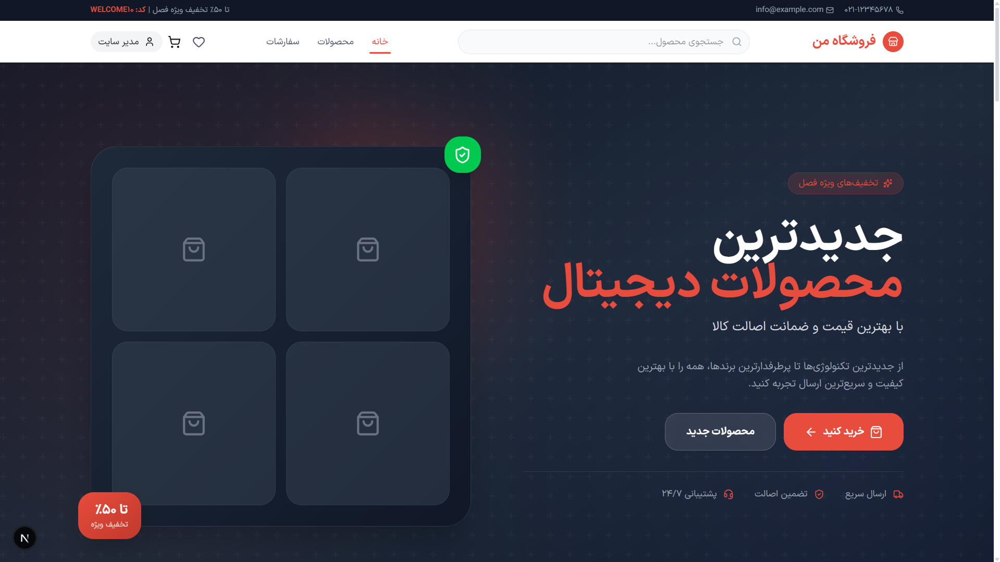
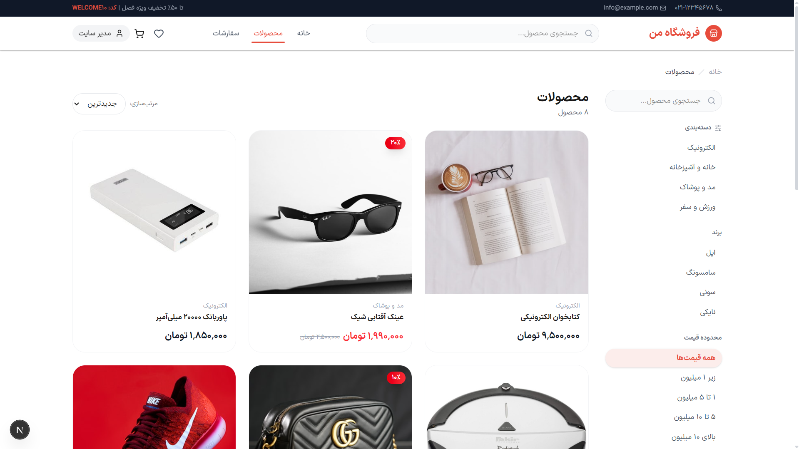
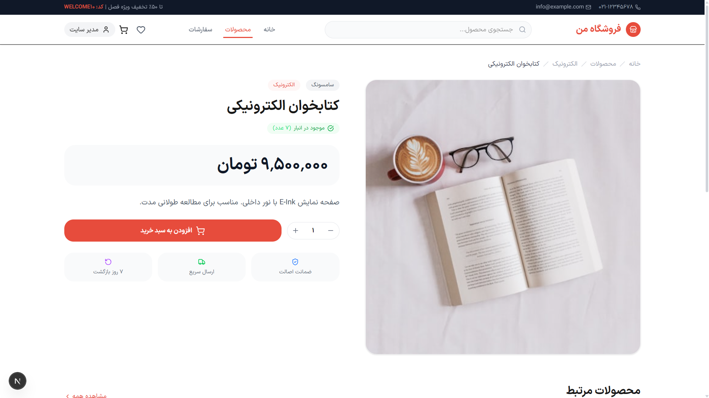
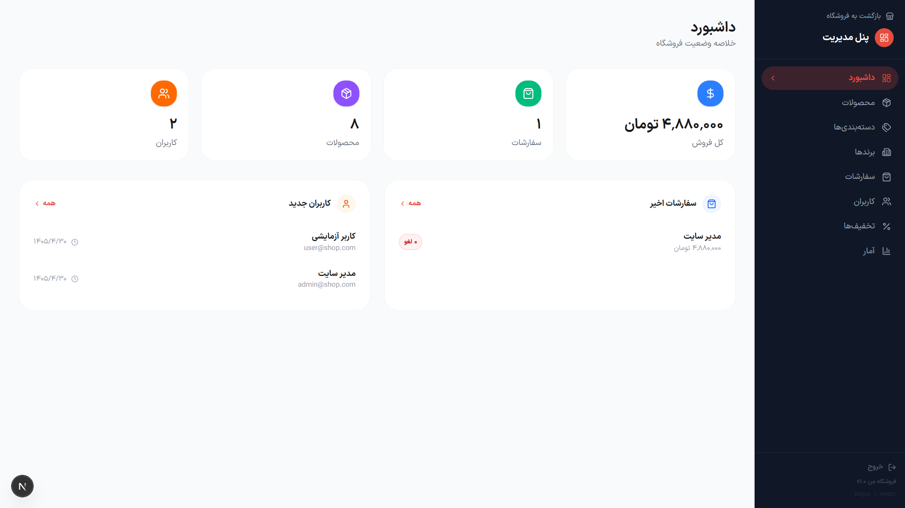
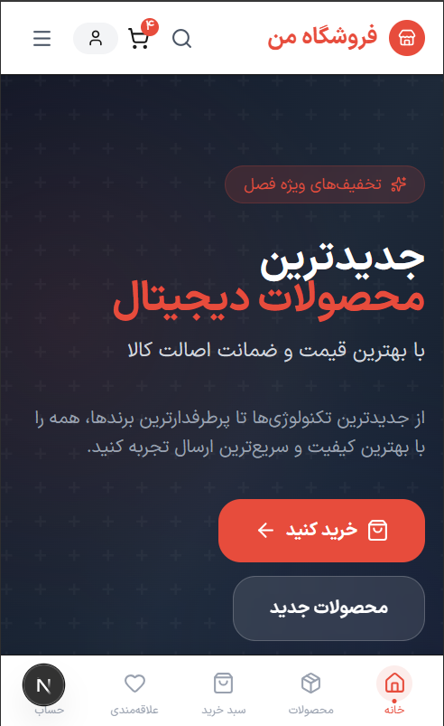

# DEQUA Ecommerce

A premium Persian **RTL** e-commerce platform — fully responsive, admin-managed, and built with Next.js 16.

> فروشگاه اینترنتی کامل و حرفه‌ای با پشتیبانی کامل از زبان فارسی و جهت راست‌به‌چپ

---

## Features

### Customer Experience
- **Homepage** — Premium hero section, featured products grid, category showcase with gradient cards, flash sale banner, brand bar, customer testimonials, newsletter signup
- **Product Browsing** — Full-text search, category/brand/price filters, sort options, responsive product grid with pagination
- **Product Details** — Image gallery, stock/discount badges, quantity selector, add-to-cart with inline controls, related products, breadcrumbs
- **Shopping Cart** — Zustand + localStorage persistence, quantity controls with stock limits, real-time badge in header, bulk clear
- **Checkout** — Progress steps, shipping form with validation, order summary with thumbnails, trust badges
- **User Account** — Profile editing, password change, order history with status timeline, wishlist management
- **Authentication** — Login/register with NextAuth v5, role-based session, demo credentials hint

### Admin Dashboard
- **Dashboard** — Stats cards (revenue, orders, products, users), recent orders list, new users
- **Analytics** — Interactive sales charts with daily/weekly/monthly period selector
- **Product Management** — Full CRUD with search, category/brand filters, image upload, inline status
- **Category & Brand Management** — Inline CRUD with product counters
- **Order Management** — Order list with inline status changes, status timeline
- **User Management** — Search, role toggles (USER/ADMIN), active/inactive status
- **Discount Codes** — Full CRUD with enable/disable toggle, expiration, percent badges

### Design System
- **Premium UI** — Dark gradient hero, consistent card-based layouts, subtle shadows and hover animations
- **RTL Optimized** — Full Persian text direction, IranSansX font, Arabic numeral support
- **Responsive** — Mobile-first with bottom navigation, touch-friendly targets, adaptive grids
- **Animations** — CSS-only fade-in, scale, slide transitions (no external animation library)
- **Accessibility** — Semantic HTML, aria labels, keyboard navigation, focus rings

---

## Technology Stack

| Layer | Technology |
|-------|-----------|
| **Framework** | Next.js 16 (App Router, Turbopack) |
| **Language** | TypeScript |
| **Styling** | TailwindCSS v4 (CSS variables, `@theme`) |
| **Font** | IranSansX (FaNum) — Persian & Arabic numeral support |
| **Database** | SQLite via Prisma 7 |
| **Authentication** | NextAuth v5 (Credentials, JWT) |
| **State Management** | Zustand 5 (cart persistence with localStorage) |
| **Charts** | Recharts |
| **Icons** | Lucide React |
| **Validation** | Zod |
| **Middleware** | Next.js 16 Proxy (route protection) |

---

## Project Architecture

```
src/
├── app/                          # Next.js App Router
│   ├── (auth)/                   # Login & register pages
│   ├── (shop)/                   # Homepage, products, cart, checkout
│   ├── account/                  # Profile, orders, order detail, wishlist
│   └── admin/                    # Dashboard, analytics, all CRUD pages
├── components/
│   ├── account/                  # ProfileForm, ChangePasswordForm
│   ├── admin/                    # SalesChart, ProductForm, CRUD managers, badges
│   ├── auth/                     # LoginForm, RegisterForm, UserMenu
│   ├── cart/                     # CartItemRow, CartSummary, CartBadge, AddToCartButton
│   ├── checkout/                 # CheckoutForm
│   ├── home/                     # HeroSection, FeaturedProducts, Testimonials, etc.
│   ├── layout/                   # Header, Footer, ShopLayout, MobileBottomNav
│   ├── products/                 # ProductCard, ProductFilters, SortSelector
│   └── ui/                       # Input, Button
├── lib/
│   ├── actions/                  # Server actions (auth, products, orders, admin, profile)
│   ├── store/                    # Zustand cart store
│   ├── auth.ts                   # NextAuth configuration
│   └── db.ts                     # Prisma client singleton
└── generated/prisma/             # Generated Prisma client
```

### Key Design Decisions

- **Server Components by default** — Product lists, order history, admin tables render on the server
- **Client Components only where needed** — Cart, forms, charts, filters, interactive UI
- **Zustand + localStorage** — Cart persists across sessions without server round-trips
- **Next.js Server Actions** — All mutations use form actions (no REST API)
- **Prisma eager-loading** — `include` patterns avoid N+1 queries
- **CSS-only animations** — No Framer Motion dependency, pure Tailwind transitions
- **Hydration-safe patterns** — All client data (Zustand, session) guarded with mount state

---

## Screenshots

| Page | Preview |
|------|---------|
| **Homepage** |  |
| **Products** |  |
| **Product Detail** |  |
| **Checkout** |  |
| **Dashboard** |  |
| **Mobile** |  |

---

## Getting Started

### Prerequisites

- Node.js 20+
- npm or yarn

### Installation

```bash
git clone <repo-url>
cd ecommerce
npm install
```

### Environment Variables

Copy `.env.example` to `.env.local`:

```bash
cp .env.example .env.local
```

| Variable | Description | Default |
|----------|-------------|---------|
| `NEXTAUTH_URL` | Application URL | `http://localhost:3000` |
| `NEXTAUTH_SECRET` | JWT encryption secret **(required)** | — |
| `NEXT_PUBLIC_SITE_URL` | Public site URL for SEO metadata | `http://localhost:3000` |

### Database Setup

```bash
# Run migrations
npm run prisma:migrate

# Seed sample data (products, users, categories, brands, discounts)
npm run prisma:seed
```

### Development

```bash
npm run dev
```

Open [http://localhost:3000](http://localhost:3000).

### Production Build

```bash
npm run build
npm start
```

---

## Demo Accounts

| Role | Email | Password |
|------|-------|----------|
| **Admin** | `admin@shop.com` | `123456` |
| **User** | `user@shop.com` | `123456` |

### Seed Data

The seed script creates:
- 2 users (1 admin + 1 regular)
- 4 categories (الکترونیک, مد و پوشاک, خانه و آشپزخانه, ورزش و سفر)
- 4 brands (سامسونگ, اپل, نایکی, سونی)
- 8 products with prices, discounts, and placeholder images
- 1 discount code (WELCOME10 — 10% off)

---

## Security

- **Authentication**: NextAuth v5 with JWT strategy, bcrypt password hashing
- **Route Protection**: Proxy middleware blocks `/admin/*` (ADMIN role) and `/account/*` (authenticated)
- **Server Actions**: All mutations check session authorization server-side
- **Validation**: Zod schemas on all server action inputs
- **SQL Injection**: Prisma parameterized queries throughout
- **XSS**: React's default escaping, no `dangerouslySetInnerHTML`
- **CSRF**: Next.js Server Actions are inherently CSRF-protected

---

## Future Improvements

- [ ] Payment gateway integration (Zarinpal, etc.)
- [ ] Email notifications on order status changes
- [ ] Product reviews and ratings with star input
- [ ] Advanced search (Elasticsearch / Meilisearch)
- [ ] Multi-vendor marketplace support
- [ ] PWA with offline support
- [ ] Unit and E2E testing (Vitest, Playwright)
- [ ] CI/CD pipeline (GitHub Actions)
- [ ] Docker Compose deployment
- [ ] Image optimization with Next.js `<Image>` component
- [ ] i18n for multi-language support
- [ ] Dark mode toggle

---

<p align="center">
  <sub>Built with ❤️ by <strong>DEQUA | MMADI</strong></sub>
</p>
